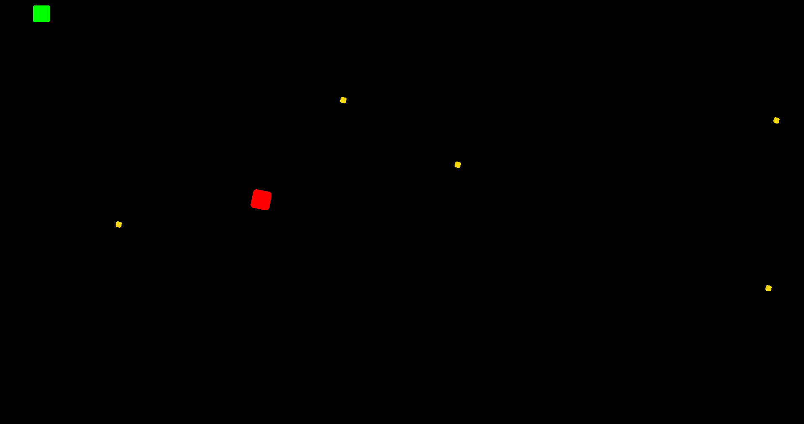

# Lua Box Chaser

A first try at using the [Lua](https://www.lua.org/) 2D game-making framework [LOVE](https://love2d.org/). You play as a green box, and you must evade red boxes while chasing yellow boxes. Very exciting stuff!

Has a little bit of drawing, rotation, input handling, collision detection, rudimentary scene-handling, and sound-playing code, plus a bit of a progression from very easy -> not very easy at all. Upon death, the player restarts from the level they were last on. Uses the [SLAM library](https://love2d.org/wiki/SLAM) to allow multiple versions of sounds to be played simultaneously.

Sound effects are made with [jsfxr](https://sfxr.me/) and the (lousy) music was made with [Bosca Ceoil](https://terrycavanagh.itch.io/bosca-ceoil), a weird, fun, and free little tracker made by Terry Cavanagh of Super Hexagon and VVVVVV fame.

You need a local installation of the Love2D framework to be able to play this game; just clone the game locally and then drag the directory on top of the Love2D shortcut or executable, and it'll load the contents of main.lua.

## License

Consider this game public domain, up to the bounds of the SLAM library or Love2D framework's own licenses.
